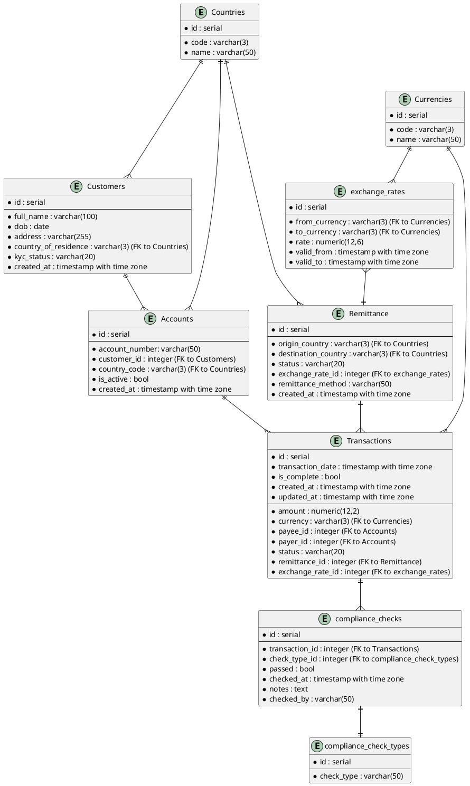

# Use Case + Business Question Definition
The goal of this dataset and the subsequent staging, intermediate and mart models is to enable compliance reporting for remittances and global transactions in Snowflake, supporting stakeholder queries.

